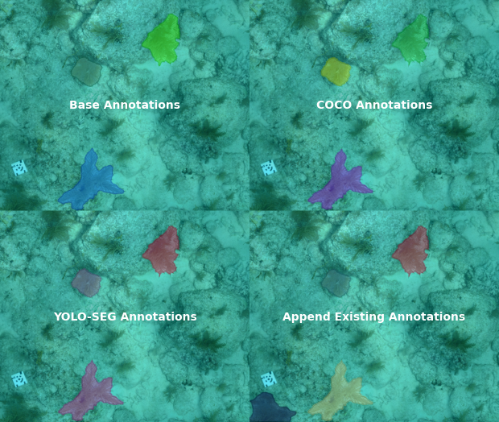

## Introduction

Annotation Handler is a lightweight Python package designed to streamline image annotation workflows by offering a universal annotation format and various utility functions. It allows you to easily convert labeled boolean masks into popular formats such as COCO and YOLOSEG, as well as append annotations and display annotations.

<p align="center">
  
</p>

## Installing

For now, just clone the project and install any dependencies that re needed

```
git clone https://github.com/JoeWilder/AnnotationHandler.git
```


## Getting Started

This project is meant to be used as a dependency for other projects. To see the functionality of this package in action, run main.py from the src directory

```
cd src
python main.py
```


## Version History

* 0.1
    * Initial Release

## License

This project is licensed under the MIT License - see the LICENSE.md file for details


